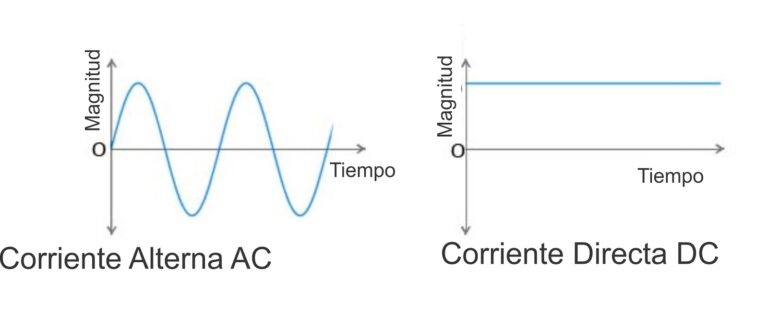

# Bases de Circuitos Eléctricos

La base de los circuitos eléctricos es la electricidad, que también es la base para la electrónica digital y posteriormente la computación, para este capitulo abarcaremos los conceptos básicos para poder entrar de lleno a la materia

Contenido

- [Electricidad](#electricidad)
- [Conceptos Básicos](#conceptos-básicos)
  - [Voltaje](#voltaje)
  - [Corriente](#corriente-eléctrica)
    - [Directa](#corriente-directa)
    - [Alterna](#corriente-alterna)
    - [Polaridad](#polaridad)

## Electricidad

Partimos en definir que es la electricidad, sin dar tanto rodeos, viene principalmente de los _electrones_ un de los subparticulas con conforma al átomo y que tiene como principal característica de ser negativos, los electrones son los protagonistas, estos también son llamados cargas electricas.

## Conceptos Básicos

### Voltaje

El voltaje (también llamado Diferencial Potencial o Tensión Eléctrica) es la energía necesaria para hacer que los electrones viajes a través de un medio, es decir la energía necesaria para que electrones se viajen a través de un medio.

### Corriente Eléctrica

El camino recorrido mediante un medio realizado por los electrones (cargas) y a cierta velocidad de cambio respecto al tiempo es llamada corriente eléctrica y este es medido en ampares.

`1 ampere = 1 columb / 1 seg`

#### Corriente Directa

Los electrones (cargas) viajan en un solo sentido desde un polo a otro, no necesariamente se mantiene constante si no que puede fluctuar pero la dirección es la misma, ya si esta es constante se llama corriente continua, es decir los amperes son constantes.

#### Corriente Alterna

Los electrones (cargas) se mueven oscilando por lo que su dirección cambia respecto al tiempo, es decir este alterna de un sentido a otro.

#### Polaridad

Es es el sentido en en el que viajan los electrones, a lo que llamamos diferencia potencial, como si hablaron de una pelota (carga)  en una rampa inclinada, donde la parte superior es el positivo y el inferior negativo, siendo el viaje del positivo al negativo, donde se considera los los polos y el sentido del viaje de las cargas.

